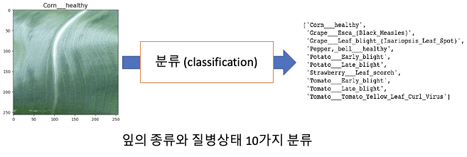
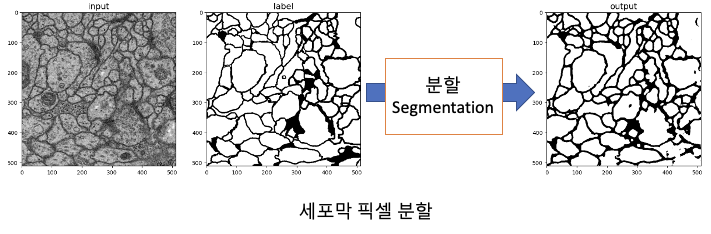

# SimpleDNN_ex
GPU 동작확인 및 학습 시간 테스트를 진행할만한 딥러닝 주제 모음 (Pytorch)

## repository 구성
### 1. img_classification
* 식물 잎 이미지를 활용한 질병 분류

### 2. img_segmentation
* 현미경 세포 이미지를 활용한 세포막 픽셀 분할

### 3. time_results
* 기존에 실험했던 환경 별 학습수행시간 측정 결과 모음
